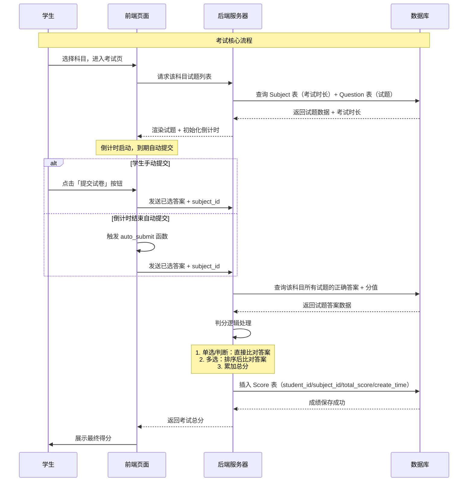

# Python 在线考试系统 UML 建模说明

这个在线考试系统的 UML 模型主要包含 **类图**（核心）和 **用例图**，分别用于描述系统的**静态结构**（类、属性、关系）和**动态行为**（角色功能、用例场景）。

## 一、UML 用例图（系统功能与角色关系）

用例图用于描述不同角色（参与者）能在系统中执行的操作，核心参与者分为 3 类，覆盖系统全部功能场景。

### 1. 参与者（Actor）

|   参与者    |            角色说明            |
| :---------: | :----------------------------: |
|  **Admin**  | 系统管理员，负责后台配置与管理 |
| **Teacher** |    教师，负责成绩查看与导出    |
| **Student** |  学生，负责选择班级、参与考试  |

### 2. 核心用例与关系

```plaintext
+-----------------+       +------------------------+
|    Admin        |       |    班级管理            |
+-----------------+       | - 添加班级             |
       |                  | - 删除班级             |
       |                  | - 查看班级学生数       |
       |                  +------------------------+
       |
       |                  +------------------------+
       |                  |    科目管理            |
       |                  | - 添加科目（含时长）|
       |                  | - 删除科目（级联删除）|
       |                  | - 关联试题列表         |
       |                  +------------------------+
       |
       |                  +------------------------+
       +----------------->|    试题管理            |
       |                  | - 单题增/删/改        |
       |                  | - Excel批量导入试题    |
       |                  | - 按科目筛选试题       |
       |                  +------------------------+
       |
       |                  +------------------------+
       |                  |    系统管理            |
       |                  | - 初始化默认用户       |
       |                  | - 权限校验            |
       +----------------->+------------------------+

+-----------------+       +------------------------+
|    Teacher      |       |    成绩管理            |
+-----------------+       | - 按科目/班级查成绩   |
       |                  | - 统计平均分/最高分    |
       |                  | - Excel导出成绩表      |
       +----------------->+------------------------+

+-----------------+       +------------------------+
|    Student      |       |    考试参与            |
+-----------------+       | - 选择班级             |
       |                  | - 查看考试科目列表     |
       |                  | - 限时答题（倒计时）|
       |                  | - 提交试卷（手动/自动）|
       |                  | - 查看考试成绩         |
       +----------------->+------------------------+
```

### 3. 用例间的依赖关系

- **试题管理** 依赖 **科目管理**：必须先创建科目，才能为科目添加试题。
- **考试参与** 依赖 **班级管理**：学生必须先选择班级，才能进入考试。
- **成绩管理** 依赖 **考试参与**：只有学生完成考试，教师才能查看对应成绩。

## 二、UML 类图（系统静态结构）

类图用于描述系统中核心类的**属性、方法**，以及类与类之间的**关联、继承、聚合**关系。

### 1. 核心类与属性

|         类名         |                           核心属性                           |                  关键方法                  |
| :------------------: | :----------------------------------------------------------: | :----------------------------------------: |
|  **Class**（班级）   |             id: Integer (PK) name: String (唯一)             |                     -                      |
|   **User**（用户）   | id: Integer (PK)username: String (唯一)password: Stringrole: Stringclass_id: Integer (FK) | load_user(): Usercheck_password(): Boolean |
| **Subject**（科目）  |  id: Integer (PK)name: String (唯一)exam_duration: Integer   |                     -                      |
| **Question**（试题） | id: Integer (PK)subject_id: Integer (FK)question_type: Stringtitle: Textoption_a/b/c/d: Stringanswer: Stringscore: Integer |                     -                      |
|  **Score**（成绩）   | id: Integer (PK)student_id: Integer (FK)subject_id: Integer (FK)total_score: Integercreate_time: DateTime |                     -                      |

### 2. 类之间的关系

#### （1）关联关系（Association）

- Class 与 User：一对多（1:N）

  - 一个班级可以包含多个学生，一个学生只能属于一个班级。
  - 关联属性：`User.class_id` 关联 `Class.id`。

  

- Subject 与 Question：一对多（1:N）

  - 一个科目包含多道试题，一道试题只能属于一个科目。
  - 关联属性：`Question.subject_id` 关联 `Subject.id`，且**级联删除**（删除科目时自动删除试题）。

  

- Subject 与 Score：一对多（1:N）

  - 一个科目对应多条成绩记录，一条成绩只能属于一个科目。
  - 关联属性：`Score.subject_id` 关联 `Subject.id`。

  

- User 与 Score：一对多（1:N）

  - 一个学生可以有多条成绩记录，一条成绩只能属于一个学生。
  - 关联属性：`Score.student_id` 关联 `User.id`。

  

#### （2）继承关系（Inheritance）

- **User 类** 是抽象基类，通过 `role` 属性区分 **Admin/Teacher/Student** 三个角色，属于**角色继承**（无显式父类，通过属性实现角色划分）。

#### （3）依赖关系（Dependency）

- **Score 计算** 依赖 **Question**：学生成绩的计算需要读取试题的 `score` 属性和 `answer` 属性。
- **限时考试** 依赖 **Subject**：考试倒计时的时长由 `Subject.exam_duration` 决定。

### 3. 类图可视化结构

```plaintext
+----------------+          +----------------+
|     Class      |          |     User       |
+----------------+          +----------------+
| - id: Integer  |<-------->| - id: Integer  |
| - name: String | 1    N   | - username:Str |
+----------------+          | - password:Str |
                            | - role: String |
                            | - class_id:Int |
                            +----------------+
                                   |
                                   | 1
                                   |
                                   | N
                            +----------------+
                            |     Score      |
                            +----------------+
                            | - id: Integer  |
                            | - student_id:Int|
       +----------------+  | - subject_id:Int|
       |    Subject     |< | - total_score:Int|
       +----------------+  | - create_time:DT|
       | - id: Integer  |  +----------------+
       | - name: String |         ^
       | - duration:Int |         |
       +----------------+         |
              |                   |
              | 1                 | N
              |                   |
              | N                 |
       +----------------+
       |   Question     |
       +----------------+
       | - id: Integer  |
       | - subject_id:Int|
       | - type: String |
       | - title: Text  |
       | - option_a-d:Str|
       | - answer: String|
       | - score: Int   |
       +----------------+
```

## 三、补充说明

1. 边界类与控制类

   - 边界类：对应前端模板（如 `login.html`、`student_exam.html`），负责与用户交互。
   - 控制类：对应后端路由函数（如 `student_exam()`、`auto_submit()`），负责业务逻辑处理。

2. 数据持久化

   - 所有类的属性通过 SQLAlchemy 映射到 SQLite 数据库表，实现数据持久化存储。

3. 核心业务流程

   ```plaintext
   管理员创建班级/科目 → 管理员添加/导入试题 → 学生选择班级 → 学生参与限时考试 → 系统自动判分 → 教师查看/导出成绩
   ```




